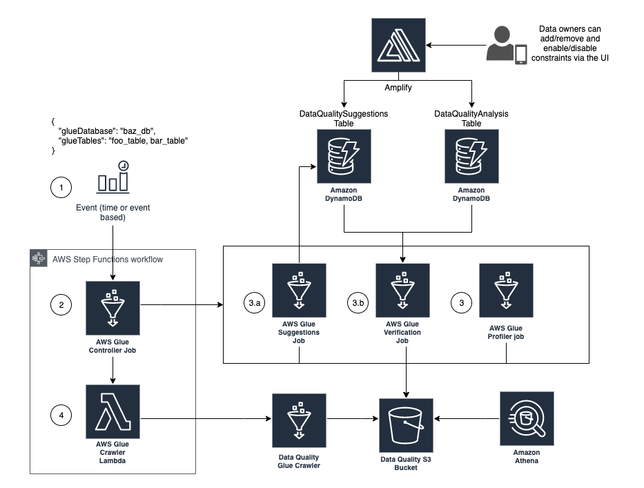

## Data Quality with Amazon Deequ on AWS Glue

[Amazon Deequ](https://github.com/awslabs/deequ) is an open source library built on top of Apache Spark for defining “unit tests for data”. It is used internally at Amazon for verifying the quality of large production datasets, particularly to:

* Suggest data quality constraints on input tables/files
* Verify aforementioned suggested constraints
* Compute quality metrics
* Run column profiling

More details on Deequ can be found in this [AWS Blog](https://aws.amazon.com/blogs/big-data/test-data-quality-at-scale-with-deequ/).

A data quality framework based on Amazon Deequ and running on AWS Glue is  showcased in this repository. It takes a Glue database and tables as inputs and outputs various data quality metrics into S3. Additionally, it performs an [automatic generation of constraints](https://github.com/awslabs/deequ/blob/master/src/main/scala/com/amazon/deequ/examples/constraint_suggestion_example.md) on previously unseen data. The suggestions are stored in a DynamoDB table and can be reviewed and amended at any point by data owners. They are **disabled** by default. Once enabled, they are used by the Glue jobs to carry out the data quality checks on the tables.

### Deployment
To deploy the infrastructure and code, you'll need an AWS account and a correctly [configured AWS profile](https://docs.aws.amazon.com/cli/latest/userguide/cli-chap-configure.html) with enough permissions to create the architecture below.

```bash
cd ./src
./deploy.sh -p <aws_profile> -r <aws_region>
```
All arguments to the ```deploy.sh``` script are optional. The default AWS profile and region are used if none are provided. The script will:
1. Create an S3 bucket to host Amazon Deequ Scripts and Jar
2. Create a CloudFormation stack named ```amazon-deequ-glue``` holding all the infrastructure listed below
3. Upload the Amazon Deequ scripts and Jar to the S3 bucket

The same command can be used for both creating and updating infrastructure.

### Detailed step-by-step


1. A time-based CloudWatch Event Rule created by the stack is configured to trigger the data quality step function, passing a JSON with the relevant metadata (i.e glueDatabase and glueTables). It is scheduled to fire every 30 minutes and is disabled by default
2. The first step in the data quality step function makes a synchronous call to the AWS Glue Controller job. This Glue job is responsible for determining which data quality checks should be performed
3. Below Glue jobs can be triggered by the Controller:
    - (Phase a) ***Suggestions Job***: is started when working on **previously unseen data** to perform automatic suggestion of constraints. The job would first recommend column-level data quality constraints inferred from a first pass on the data that it then logs in the ```DataQualitySuggestion``` DynamoDB table. It also outputs the quality checks results based on these suggestions into S3. The suggestions can be reviewed and amended at any point by data owners
    - (Phase b) ***Verification Job***: reads the user-defined and automatically suggested constraints from both the ```DataQualitySuggestion``` and ```DataQualityAnalysis``` DynamoDB tables and runs 1) a constraint verification and 2) an analysis metrics computation that it outputs in parquet format to S3
    - ***Profiler Job***: is always run regardless of the phase. It performs single-column profiling of data. It generates a profile for each column in the input data, including the completeness of the column, the approximate number of distinct values and the inferred datatype
4. Once the Controller job succeeds, the second step in the data quality step function is to trigger an AWS Lambda which calls the ```data-quality-crawler```. The metrics in the data quality S3 bucket are crawled, stored in a ```data_quality_db``` Glue catalog and are immediately available to be queried in Athena 

### Testing
We assume you have a Glue database hosting one or more tables in the same region as where you deployed this framework.

1. Navigate to Step Functions in the AWS console and select the ```data-quality-sm```. Start an execution inputting a JSON like the below:
    ```
    {
        "glueDatabase": "my_database",
        "glueTables": "table1,table2"
    }
    ```
    The data quality process described in the previous section begins and you can follow it by looking at the different Glue jobs execution runs. By the end of this process, you should see that data quality suggestions were logged in the ```DataQualitySuggestions``` DynamoDB table as well as Glue tables in the ```data_quality_db``` Glue catalog which can be queried
2. In ```DataQualitySuggestions``` DynamoDB table, notice how the ```enable``` field is set to ```N``` for all suggestions. You can review, edit, add and remove suggestions as you see fit. An entry in the table should look like this:
    ```
    {
        "id": "##my_database##table1##my_column##1",
        "constraintCode": ".isComplete(\"my_column\")",
        "constraint": "'my_column' is not null",
        "enable": "Y",
        "column": "my_column",
        "tableHashKey": "my_database-table1"
    }
    ```
    To enable a suggestion, simply set the ```enable``` flag to ```Y```
3. Optionally, you can also provide data quality constraints in the ```DataQualityAnalysis``` DynamoDB table. These constraints are used by Deequ to calculate column-level statistics on the dataset (e.g. CountDistinct, DataType, Completeness…) called metrics (Refer to the Data Analysis section of this [blog](https://aws.amazon.com/blogs/big-data/test-data-quality-at-scale-with-deequ/) for more details). Here is an example of an analysis constraint entry:
    ```
    {
        "id": "##my_database##table1##my_column##1",
        "analyzerCode": "Completeness(\"my_column\")",
        "enable": "Y",
        "tableHashKey": "my_database-table1"
    }
    ```
4. Start a new execution of the step function with the same JSON as an input. This time the Glue jobs use the suggestions logged in both DynamoDB tables to perform the data quality checks. Once more, the results can be immediately queried in Athena

An exhaustive list of suggestion and analysis constraints can be found in the [docs](./docs/constraints/).

### Future enhancements
Future implementation may include a web portal for users to view and modify the suggestions and analysis constraints.

### Dependencies
- Amazon Deequ 1.0.3-RC1.jar
- Spark 2.2.0 (Scala)

## Security

See [CONTRIBUTING](CONTRIBUTING.md#security-issue-notifications) for more information.

## License

This library is licensed under the MIT-0 License. See the LICENSE file.

